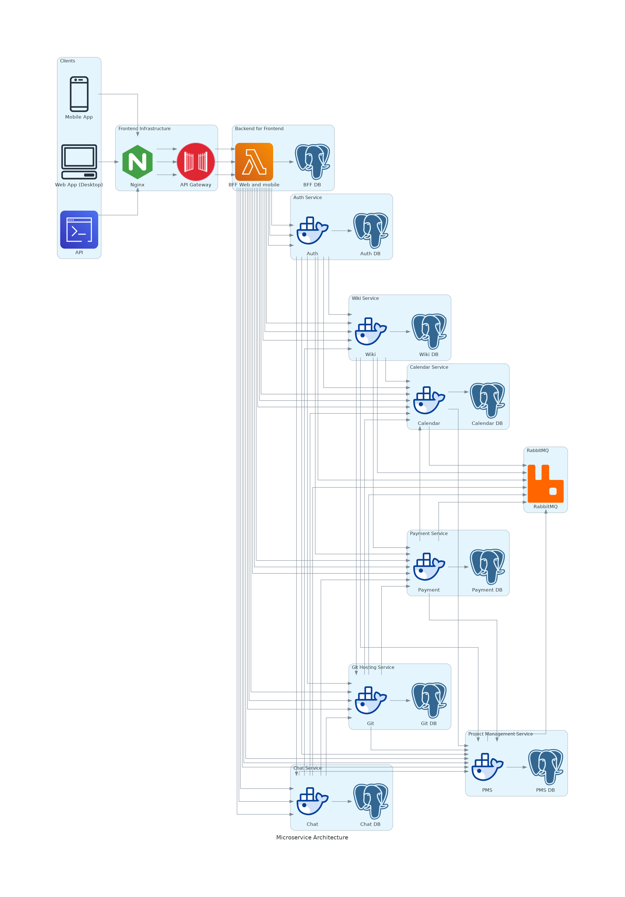

<div align="center">

  <h1>Corpspace</h1>

<!-- Badges -->
<p>
    <a href="https://github.com/sulsoltanoff/corpspace/graphs/contributors">
        
    </a>
    <a href="">
        
    </a>
    <a href="https://github.com/sulsoltanoff/corpspace/issues/">
        
    </a>
    <a href="https://github.com/sulsoltanoff/corpspace/actions/workflows/codeql.yml">
        
    </a>
    <a>
        
    </a>
    <a>
        
    </a>
    <a href="https://github.com/sulsoltanoff/corpspace/blob/main/LICENSE">
        
    </a>
</p>

<h4>
    <a href="https://github.com/sulsoltanoff/corpspace">Documentation</a>
  <span> · </span>
    <a href="https://github.com/sulsoltanoff/corpspace/issues/new?assignees=&labels=Type%3A+Bug+%3Acry%3A&template=bug-report.md&title=">Report Bug</a>
  <span> · </span>
    <a href="https://github.com/sulsoltanoff/corpspace/issues/new?assignees=&labels=Type%3A+Enhancement+%3Arocket%3A&template=feature-request.md&title=">Request Feature</a>
  </h4>
</div>

<br />

Corpspace is an open-source project designed to make collaboration easier than ever. 
Built on .NET Core 7 and Angular, it utilizes a microservice architecture to provide an array of features for teams to work smarter and faster. 
With Corpspace, you can easily communicate with your team through chat, track projects using our project management tools, and host git repositories. 
Plus, with our intuitive UI, you can quickly find the information you need and get back to work.
Our team-oriented approach is designed to make collaboration a breeze. 
Corpspace provides a comprehensive suite of tools and features that make it easy to stay organized and productive. 
So, if you're looking for an open-source project that will help you and your team work better, try Corpspace today and experience the power of collaborative teamwork!

> **Warning**
> We are currently in the process of developing our platform and are open to feedback and suggestions from the community. We hope to make corpspace a better platform for online meetings and look forward to your thoughts and ideas.

> _We would also be pleased if you could suggest an alternative solution._ 

<!-- Table of Contents -->

# Table of Contents

- [About the Project](#about-the-project)
  - [Platform architecture](#platform-architecture) 
  - [Installation](#installations)
- [License](#license)

## About the Project

### Platform architecture
Draft scheme architecture. We're using [diagrams](https://github.com/mingrammer/diagrams) for this creating.


### Installations
1. Clone git repository
```bash
  git clone git@github.com:sulsoltanoff/corpspace.git
  # OR HTTP
  git clone https://github.com/sulsoltanoff/corpspace.git
```

2. Build .NET solutions and run infrastructure.
```bash
    cd corpsace/src
    dotnet build Corpspace.sln
    dotnet restore Corpspace.sln
```
```bash
    python run-test-infra.py
```

## License

Distributed Apache License Version 2.0
See [LICENSE](./LICENSE) for more information.